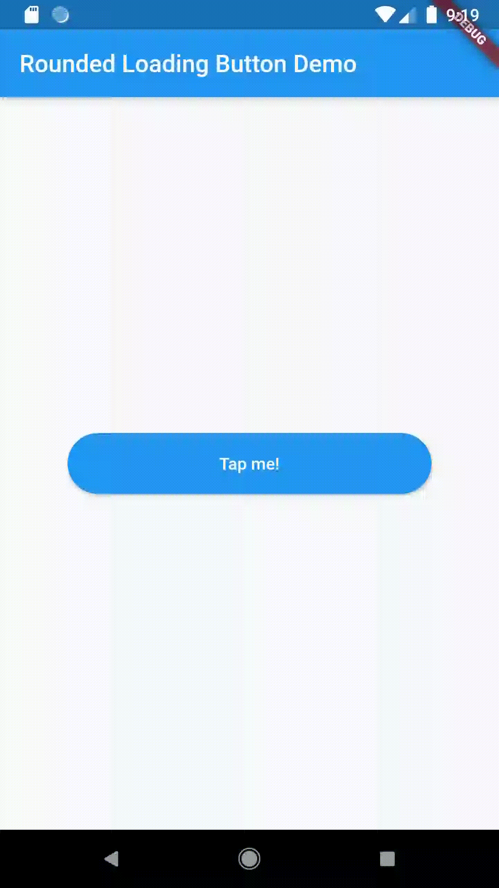

# rounded_loading_button

 

RoundedLoadingButton is a Flutter package with a simple implementation of an animated loading button, complete with success and error animations.

## Installation

   Add this to your pubspec.yaml:
    
    dependencies:
        rounded_loading_button: ^1.0.0

## Usage

### Import

    import 'package:rounded_loading_button/rounded_loading_button.dart';

### Simple Implementation

    final RoundedLoadingButtonController _btnController = new RoundedLoadingButtonController();

    void _doSomething() async {
        Timer(Duration(seconds: 3), () {
            _btnController.success();
        });
    }

    RoundedLoadingButton(
        child: Text('Tap me!', style: TextStyle(color: Colors.white)),
        controller: _btnController,
        onPressed: _doSomething,
    )
    
## Contributions

   All contributions are welcome!
   
## Did you find this useful?

